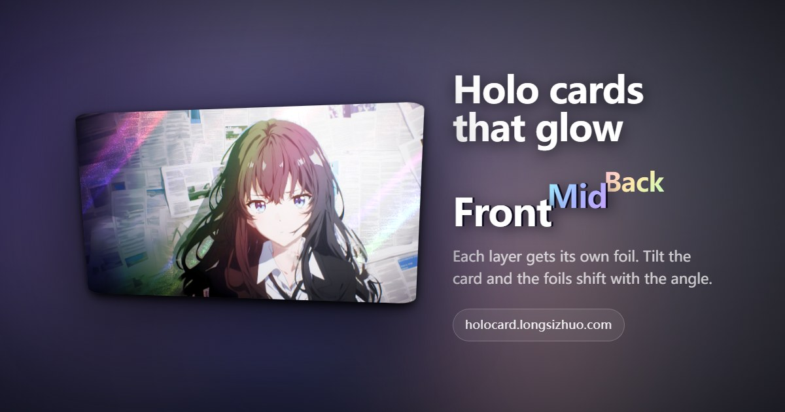

# HoloCard

[中文](README.md) | English

[](https://holocard.longsizhuo.com/?lang=en)

https://github.com/longsizhuo/holocard ｜ Live: https://holocard.longsizhuo.com

Upload a photo: it is split into foreground, midground and background, each layer gets its own holographic foil, and the result is an interactive holo card.

The foil effects and the interaction feel are ported from [pokemon-cards-css](https://github.com/simeydotme/pokemon-cards-css)
(Simon Goellner, GPL-3.0). In that project every card needs a hand-made mask image that marks "where the foil shows through";
what HoloCard adds is **generating that mask automatically with a layering algorithm**, so any photo can become a holo card.

> Status: early. The renderer, the layering pipeline, edge refinement and server-side processing all work and are live: https://holocard.longsizhuo.com
> The site is available in Chinese, English and Japanese; finished cards can be saved as a GIF on iPhone, an Android Motion Photo, or an animated PNG on desktop.

## What a card is made of

The structure mirrors how real holo cards are printed: the base is foil, the subject is covered with opaque ink so it stays matte, the background is not, so it shines.

| | Covers | Moves with parallax | When it shows |
|---|---|---|---|
| **Depth layers** | Each layer's own image | Yes, each with its own factor | Always |
| **Per-layer foil** | Only inside that layer's alpha shape | Yes, with its layer | As soon as you hover |
| **Card-wide halo** | The whole card | No | A faint rainbow, only at certain tilt angles |
| **Card-wide glare** | The whole card | No | Follows the pointer |

By default the farthest layer gets a sunpillar foil, the middle layer a classic holo foil, and the nearest layer (the subject) stays matte.
The demo page has a dropdown per layer to change it.

Each layer's image and foil are wrapped in the same container with a `transform`, which does two things: the foil naturally moves with its layer,
and the `transform` creates its own stacking context, so the foil's `color-dodge` only blends with **that layer's own image**
instead of bleeding into the layers behind it.

## Layering pipeline

```
photo
 └→ Depth Anything V2-Small ──→ continuous depth map (decides layer order)
      └→ cut at valleys of the depth histogram ──→ adaptive, 2–4 layers
           └→ BiRefNet_lite subject matte (server only) ──→ the subject gets its own layer; only depth cuts behind it are kept
           └→ depth-edge snapping + foreground growth ──→ object edges become clean steps
                └→ guided-filter refinement ──→ layer boundaries snap to real object edges in the photo
                     └→ per-layer alpha (which is also that layer's foil mask)
                          └→ per-layer completion + mirrored texture fill ──→ each layer extends behind the layers covering it
                               └→ .layers ──→ renderer
```

Each layer plays two roles at once: an image with parallax, and the mask for that layer's foil. So two kinds of information are needed:

- **What is in front** (ordering): from monocular depth estimation. A matting model only separates "subject / background" and cannot order three or more layers.
- **Where the boundary is** (mask quality): the mask edge is the foil edge, and a ragged edge is obvious at a glance.
  The subject's boundary comes from a matting model (server side, see "BiRefNet: subject matting on the server" below); boundaries inside the background come from depth.
  Depth maps are blurry at object edges and often shrink a few pixels into the object, so those are refined separately, see "Edge refinement" below.

A few design decisions:

**Layer boundaries sit at valleys of the depth histogram instead of being evenly spaced.** Valleys are the distances where the scene has little content.
Cutting through content splits an object in two. The number of layers is computed too: many photos really only have two.

**The subject's boundary must not come from depth.** With depth alone a layer boundary is an iso-depth line; when a crowd stands at one distance their depth is one continuous blob,
and wherever the line falls it runs through people. A more accurate depth model does not help — it just runs through people more accurately.
So the server first mattes out the subject: the subject gets its own layer whose outline is the matte, and depth only decides ordering and parallax.
Only depth cuts that lie behind the subject, sit on a real valley and leave a meaningful area (≥2% of the image) are kept; cuts through or in front of the subject and equal-mass fallback cuts are dropped.
Whether there is a real occlusion step between the subject and the layer behind it decides whether they may slide against each other —
lettering on a sign or the photo on an ID card get matted out as the subject, but they lie in the same plane as the background and would float if they slid.
When no subject is found (pure landscapes), or when the browser does the layering as a fallback, layering is by depth alone as before.

**Boundaries are feathered, not hard thresholds.** A hard cut glues a ring of background pixels onto the foreground layer, and that dirty ring floats with the subject once parallax kicks in.

**Depth edges are snapped into steps first.** A monocular depth map has a slope at object edges, and the middle of that slope falls right into
the "middle layer" range, forming a thin misclassified ring around the object that separates into a ghost as soon as it moves.
Morphological toggle mapping squashes steep slopes into steps; gentle surfaces with a small drop are left alone, since that is exactly where a smooth transition is wanted.

**The foreground grows outward, but only a little.** Depth boundaries are always a few pixels off from real object edges, and usually shrink into the object;
the ring that shrinks in stays behind in the layer below, so when the object moves, its own outline is left in place.
Growing nearer regions outward makes object edges travel with the object. But the background pixels swallowed by that growth are opaque,
which gives subjects in front of white walls or sky a bright rim, so the growth is only 2 pixels; keeping object edges out of the background is done instead by widening the occluded area of the background layer before filling it.

**Soft edges have the background colour removed.** A semi-transparent edge pixel mixes foreground and background: `C = a·F + (1 − a)·B`.
Storing C as-is makes hair and fur edges carry the colour of the old background along when they move. Compositing far to near, B is whatever currently sits behind the layer.
Where that is the original image (gentle depth transitions), F is solved for and stored: stacked back together at rest the layers still reproduce the original exactly.
Where it was filled in (real object edges), solving is unsafe: the fill is a guess, and its error is amplified by `(1 − a)/a`,
so a glow or rim light around the subject, or a matte that is a little too wide, pushes F to pure white and the subject drags a white outline around.
There F comes from a neighbourhood estimate instead, `F = C + (1 − a)·(local foreground mean − local background mean)` (blur-fusion, the same family as BiRefNet's own foreground estimation),
whose error is only scaled by `1 − a`, never amplified.

**Every layer except the front one is completed, not just the bottom one.** When the foreground moves away, what shows through should be a continuation of the layer right behind it.
How: for each covered pixel, find which layer the nearest visible pixel belongs to, and treat that layer as extending to it.
Completing only the bottom layer would make the middle layer end abruptly at the foreground's original outline, breaking both the image and the foil.

**The fill needs texture.** Foil uses `color-dodge` to light up bright pixels of the underlying image, and flat color patches do not light up.
So the fill mirrors real pixels from the other side of the boundary around the nearest source pixel; a push-pull smooth fill is only the fallback.
No neural network is involved: parallax offsets are only a few dozen pixels, so what gets revealed are thin strips, not big holes.
LaMa (Apache-2.0) was tried for server-side fill: 10 s and 900 MB on two cores, and when the subject fills most of the frame it extends the subject's colour into the hole,
producing a dark smudge that is itself a ghost. Not worth it.

## Edge refinement

A **guided filter** snaps layer boundaries to real object edges in the photo. No download, pure JS, works on any image.

Principle: in each local window, assume the refined alpha is a linear function of the guide image, `q = a·I + b`, fitted to the coarse mask by least squares.
Where the guide has an edge, the alpha jumps along that edge; where the guide is flat, there is nothing to fit.
On top of the standard method there are two safeguards, because we only want to fix "the layer boundary", not do general smoothing:

- It only acts inside the **uncertainty band** on both sides of a layer boundary; everything outside is left as is
- The local goodness of fit **R²** is used as confidence. If the linear model cannot explain a boundary, the photo has no edge there
  (for example where near ground meets midground ground), so it is left alone

Refinement works on "boundaries", not on "layers": once a boundary is fixed, the layers on both sides benefit, and their alphas are complementary by construction.
Two pitfalls only showed up after refinement was added:

- Layer alphas must be built from boundary masks by **subtraction**, `A₀ − A₁`, not multiplication `A₀·(1 − A₁)`.
  Boundaries are nested: an edge pixel covered by the foreground to degree t has value t for both boundaries. Subtraction gives the middle layer 0,
  multiplication gives `t(1−t)`, which conjures a ring for the middle layer along every soft edge. On hard edges they are the same, which is why it went unnoticed.
- When two boundaries fall on the same object edge (a head directly against the sky, with no middle layer nearby), they must **share the same refined edge**,
  otherwise each is refined separately, the soft edges differ, and subtracting still leaves a ring.

The guide is replaceable. It is currently the photo's RGB; anything that produces a foreground alpha can be added as an extra guide channel
(`ExtractOptions.extraGuide`) without changing the algorithm.

### BiRefNet: subject matting on the server

BiRefNet_lite (MIT) gives the subject alpha on the server, and the subject layer's boundary uses it directly without the guided filter.
It does not run in the browser — all four routes were tried — so the browser fallback does not matte the subject:

| Route | Result |
|---|---|
| WebGPU | The model has a 16-way Concat; a single shader would bind 17 storage buffers, the adapter limit is 16 |
| WASM, 1024 input | `std::bad_alloc`, the activations do not fit in the 32-bit WASM heap |
| WASM, arena allocator off | Same as above |
| WASM, 512 / 768 input | This ONNX export has the input fixed at 1024×1024 and rejects other sizes |

To reproduce: `node scripts/probe-matte.mjs --image path/to/photo`.

The first server measurement peaked at 12 GB; that was onnxruntime's memory arena, which keeps memory used by inference instead of returning it.
With it disabled the peak is 6.9 GB and memory drops back to 0.6–0.8 GB after inference, so it runs inside the service process.
The service only mattes when its memory limit (systemd `MemoryMax`) is at least 8 GB; below that it layers by depth alone instead of getting OOM-killed.

Model choice (the 16 staging images, measured against the full model, 4 ARM cores):

| Model | Per image | Peak memory | Versus the full model |
|---|---|---|---|
| Full (Swin-L), 1024 input | 54 s | 8.8 GB | —— |
| **lite (Swin-T), 1024 input** ← in use | 23 s | 6.9 GB | Subject IoU 0.885, closest edges; treats the inside of white line art as background |
| 512 model, int8 | 11 s | 4.4 GB | Subject IoU 0.885, softer edges; misses part of sign lettering |

All three share the same training set (official model zoo); lite only has a smaller backbone. fp16 is 40% slower on ARM CPUs;
quantizing lite to int8 is only 10% faster with identical results, not worth an extra self-quantization step.
Switching models only touches `MATTE_MODEL_ID` and the input size in `src/segmenter/matte.ts`.

A guided filter that uses color as the guide has a ceiling: **outlines whose color is close to the background cannot be separated**
(a black outline on a dark background gets pulled toward the background by the linear color model), and fine semi-transparent structures like hair are not as good as with a dedicated matting model.

## Renderer

The interaction feel matches upstream point by point:

- **Spring-driven**: one spring each for rotation, glare and background offset; while following the pointer `stiffness 0.066 / damping 0.25`;
  after release it waits 500ms, then eases back with a very soft spring (`0.01 / 0.06`, soft start).
  The spring semantics match svelte/motion, so upstream's tuned parameters can be used as is.
- **Rotation mapping**: `rotateY(-(x-50)/3.5) rotateX((y-50)/3.5)`, up to about ±14.3°, perspective 600px.
  The side under the pointer lifts toward the viewer.
- **Background offset is narrowed** to 37%–63% / 33%–67%, so the foil pattern drifts slightly instead of sweeping across the whole card.
- **`--pointer-from-center`** modulates brightness: the foil gets brighter toward the edges of the card.

CSS variable names (`--pointer-x`, `--background-x`, `--card-opacity` and so on) deliberately match upstream,
so more rarities can be ported later by pasting their recipes into `foils.css`.

The two textures (grain / glitter) are generated procedurally at runtime; the repository has no binary assets for them.

The parts that are our own:

**Parallax does not use `translateZ`.** It introduces perspective scaling and the layer sizes stop matching. Instead each layer gets its own 2D offset,
proportional to that layer's parallax factor. Near layers move opposite to the pointer: lifting the right edge is like the viewer stepping to the right,
so nearby things shift left relative to far ones.

**The focal plane sits in the middle, and every layer shares one scale factor.** The midpoint between the farthest and nearest layer stays still: near layers drift out, far layers recede,
so each layer only moves half as much for the same sense of depth. By default the subject and background separate by up to 6% of the card width.

**Depth inside each layer too (relief).** When a card carries a depth map, each layer's image is drawn on a WebGL mesh that moves every pixel a little more by its depth. Together with the layer translation this forms one continuous depth field: how far a pixel moves depends only on its own depth, not on which layer it was put in. With layer translation alone the subject slides in front of the background like a paper cutout, and the ground right in front of the camera moves together with the distant sky, which gets the depth wrong. The approach follows depthy (MIT) and Facebook 3D Photos, rebuilt for the layered structure; several approaches were compared side by side on a real card, see issue #29.
Shifting reveals a gap on the other side, so layers are scaled up to compensate, but **all layers must use the same factor** (taken from the layer that moves most).
Previously each layer was scaled by its own amount around the card centre, so at rest the subject was bigger than the hole it left in the background and a dog's head no longer met its body.
With one shared factor the card at rest matches the original photo pixel for pixel.

**Highlight protection.** Most foils use `color-dodge` (base ÷ (1 − foil)) and the card-wide glare uses `overlay`, so bright areas clip to pure white and the texture of white clothes or fur disappears.
Every foil mask, and the masks of the halo and glare, are therefore attenuated by image brightness: unchanged below luminance 0.6, easing down to 0.2 at pure white (`renderer/highlight.ts`).
Shadows and midtones keep the full effect; only what is about to clip is held back.
The halo and glare are laid once per parallax group, each masked by that group's own image and shifted and scaled with it; the light itself still spans the whole card.
With one static mask for the whole card, the outline in the mask drifted off the subject as soon as the layers moved: where a dark outline used to be now sat bright background under full glare, leaving a white band beside the subject.

**Tuning previews at the peak.** While a slider is being dragged the pointer is not on the card, so the card is at rest, and foils and halo only show when it tilts, parallax only when it leans.
`preview()` therefore turns the card to the halo's brightest angle while any slider moves, holds it briefly, then eases back.

**The card-wide halo is an angle event.** The card's surface normal is derived from the current rotation and dotted with the orientation that "reflects the light into the eye",
with a wide and a narrow lobe added together. With the default parameters the intensity is 0.12 at rest, 1.00 at the peak tilt, 0.01 at the opposite tilt.

**`setPose({x, y})`** puts the card straight into a pose without animation, for rendering static previews
or driving it from external input such as a gyroscope.

## The card strip and pack opening

The main stage is a strip of the cards made during this visit: switch left and right, newest on the right. The arrow buttons sit in the gutters beside the card (arrow keys work too).
After an upload a card pack appears on the far right; while it is being made you can press "<" and play with the previous card. When it is ready the pack lights up, and a dot shows on ">" if you are elsewhere.
Swipe across the top seal to tear it: the part you have swiped over lifts with your finger, and past 60% the whole strip rips off and flies away;
the card rises out of the opening and the empty pack drops away. Or tap it to shake and burst it. The new card then spins once to show itself, with a little thickness and a card back.
With reduced motion the pack opens at once, without animation.

The pack is a real 3D foil bag drawn with WebGL (`src/demo/pack-gl.ts`): a bulging body, crimped serrated seals, rainbow foil that follows the foil type,
and the involutionhell.com logo on the front. It defaults to rainbow glitter and only follows the card's background foil when someone has changed the foils (a tuned card shared by someone else).
When the card clears the opening the pack hands its on-screen position to the strip, and the real holo card carries on spinning from there (`src/demo/deck.ts`).
Devices without WebGL fall back to a flat pack: a two-layer card (body and top strip) whose artwork is drawn in the browser (`src/demo/pack-art.ts`) and handed to the same renderer.

The first time a card someone else shared is opened on a device, the stage also starts with a ready pack; once opened it is remembered on the device (`holocard:seen`) and the card shows directly next time.
Your own cards, and the pages used for screenshots and exports, never show a pack.

Opening has sound (tearing, the rip, the card sliding out, the spin, the burst, dealing, and a chime when the card is ready), all synthesised with Web Audio, no audio files (`src/demo/sfx.ts`).
While there is a pack, a speaker button in the bottom-right corner of the strip turns it off; the choice is kept on the device.

Finished cards are kept in sessionStorage so a reload restores the strip. After changing anything about pack opening:
- `node scripts/verify-pack.mjs`: walks through the flow with assertions (no layering service needed, the API is faked in the browser)
- `node scripts/film-pack.mjs`: steps a virtual clock and screenshots the opening frame by frame into contact sheets; watch the whole thing
- `node scripts/render-sfx.mjs`: renders the sounds offline to wav for listening, and checks none is silent or clipping

## My album

"My album" is simply every card made on this device, in a grid, newest first, with nothing to add by hand.
Each time it opens you first open a pack: tear or tap it and the cards fly out one by one into the grid, all dealt within 2 seconds (tap to land them all at once).
With no cards, or with reduced motion, it goes straight to the grid.
It is read from the delete-token record (each finished card stores its id and token), which lives only in this device's browser, just like delete tokens, since the site has no accounts.
The cards themselves live on the server and show as "Expired" once they are gone. Hand-made albums used to exist too; with few people using them, only this automatic one is kept for now.
Grid thumbnails (`/api/layers/<id>/thumb.jpg`, longest side 480) are made when layering finishes; early cards that never stored an original get one on first request, stacked from their layers, made once per card and queued one at a time. Code: `src/demo/albums-ui.ts`.

## The `.layers` format

This format decouples the algorithm from the renderer. Anything that produces it can feed the renderer, and the renderer can be used on its own:
layers cut by hand in Photoshop render just as well.

```
mycard.layers/
├── manifest.json
├── layer-0.png      # farthest
├── layer-1.png
└── layer-2.png      # nearest
```

```json
{
  "version": 1,
  "source": { "width": 734, "height": 1024 },
  "layers": [
    {
      "file": "layer-0.png", "depth": 0.08, "parallax": 0.0,
      "bbox": [0, 0, 734, 1024], "inpainted": true,
      "foil": { "type": "sunpillar", "intensity": 1 }
    },
    {
      "file": "layer-2.png", "depth": 0.92, "parallax": 1.0,
      "bbox": [120, 80, 500, 900], "inpainted": false,
      "foil": { "type": "none", "intensity": 1 }
    }
  ],
  "effects": {
    "halo": { "intensity": 0.35, "light": { "peakAt": [0.7, -0.7], "sharpness": 120 } },
    "glare": true
  }
}
```

Layer images can be any format the browser can decode; the server stores them as WebP (lossy image, lossless alpha), about a tenth of the PNG size.

`depthMap` points to a depth map of the whole image (single-channel greyscale PNG, brighter is nearer, longest side 512); the renderer uses it for relief inside each layer. It is optional, and older cards don't have one; without it every layer is flat.

`foil.type` currently has four values: `none` (matte), `holo` (classic holo), `sunpillar` (V-card sunpillar), `rainbow` (rainbow glitter).

## Running it

```bash
pnpm install
pnpm dev           # frontend, fixed at port 5273
pnpm dev:server    # in another terminal: the layering service, listens on 8791
```

The demo page loads a pre-layered sample card by default (`public/samples/demo`, the same card as in the social preview); dropping a photo runs the whole pipeline.
`pnpm dev` proxies `/api` to 8791; without the server it still works and falls back to the in-browser pipeline.

The server needs the weights locally on first run:

```bash
D=.models/onnx-community/depth-anything-v2-small
mkdir -p $D/onnx
B=https://huggingface.co/onnx-community/depth-anything-v2-small/resolve/main
curl -sL $B/config.json -o $D/config.json
curl -sL $B/preprocessor_config.json -o $D/preprocessor_config.json
curl -sL $B/onnx/model_quantized.onnx -o $D/onnx/model_quantized.onnx
HOLOCARD_MODEL_DIR=$PWD/.models pnpm dev:server
```

Recording a demo GIF (needs Edge and ffmpeg on the machine, and the dev servers running):

```bash
pnpm capture --image path/to/photo --out out/demo.gif
```

The script drives headless Edge through the real upload path, then poses the card frame by frame with `setPose` and takes screenshots, so every frame is deterministic.
Add `--dump` to also export every layer as PNG, which helps when debugging layering; add `--no-gif` if you only want the layers.

### Tuning the share image

```bash
pnpm og                    # render a share image from scripts/fixtures/og-test.jpg to out/og-preview.jpg and open it
pnpm og path/to/photo      # use another photo
pnpm og --watch            # re-render on save when styles or code under src/ change (about 2 seconds)
pnpm og --pose 20,80       # look at the foil and halo from another angle
pnpm og --size 1280x640    # the size of a GitHub repository social preview
pnpm og --lang en          # English copy on the right (en / ja)
pnpm og --export gif       # export the iPhone GIF (or motion / apng) to out/export/
```

It is the same rendering as production: the frontend is built on the spot and the screenshot calls the server's `renderPreview`, so what you see here is exactly what gets shared.
Layering results are cached in `.og-cache/` by image hash, so the model does not re-run while you tweak styles. Needs the weights under `.models/`.
