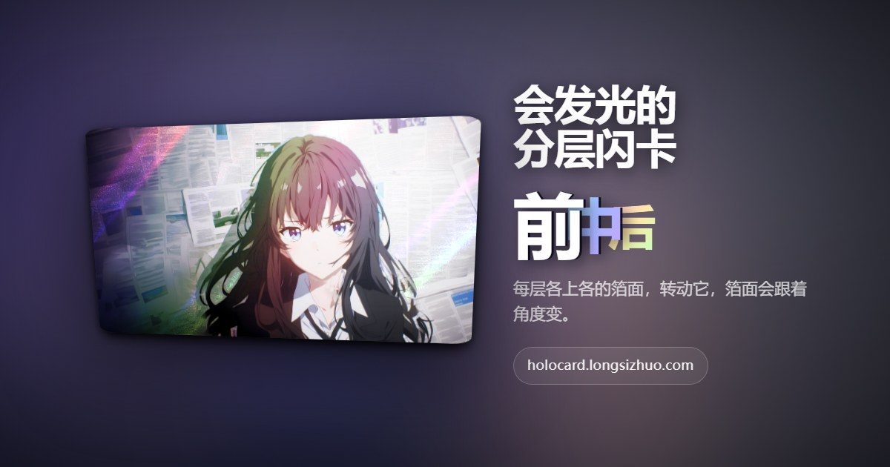

# HoloCard

中文 | [English](README.en.md)

[]([https://holocard.longsizhuo.com](https://raw.githubusercontent.com/longsizhuo/holocard/main/public/og-en.jpg))

https://github.com/longsizhuo/holocard ｜ 线上 https://holocard.longsizhuo.com

上传一张照片，自动切成前中后景，每层各上各的箔面，渲染成可交互的闪卡。

箔面效果和交互手感移植自 [pokemon-cards-css](https://github.com/simeydotme/pokemon-cards-css)
（Simon Goellner，GPL-3.0）。那个项目的每张卡都要作者手工准备一张遮罩图，标出「箔面从哪里透出来」；
HoloCard 做的事情是**用分层算法自动生成这张遮罩**，于是任意一张照片都能变成闪卡。

> 状态：早期。渲染器、分层流水线、边缘精修、服务端处理都已跑通并上线：https://holocard.longsizhuo.com
> 页面有中文、英文、日文；做好的卡可以存成动图：iPhone 上是 GIF，安卓上是动态照片，电脑上是 APNG。

## 一张卡由什么叠成

结构对应真实闪卡的印法：底材是箔，主体用不透明油墨盖住所以哑光，背景不盖所以闪。

| | 作用范围 | 随视差移动 | 何时出现 |
|---|---|---|---|
| **景深层** | 各层自己的画面 | 是，各层系数不同 | 始终 |
| **每层的箔面** | 只在该层的 alpha 形状内 | 是，跟着所在层 | 一悬停就亮 |
| **整卡炫光** | 整张卡面 | 否 | 只在特定倾角浮出细微五彩 |
| **整卡高光** | 整张卡面 | 否 | 跟随指针 |

默认的箔面分配是「最远层上日柱、中间层上经典闪卡、最近层（主体）哑光」，
演示页上每层都有下拉框可以换。

每层的画面和箔面包在同一个带 `transform` 的容器里，这有两个作用：箔面天然跟着所在层一起动；
而且 `transform` 会产生独立的层叠上下文，箔面的 `color-dodge` 只和**这一层自己的画面**混合，
不会透下去染到更远的层。

## 分层流水线

```
照片
 └→ Depth Anything V2-Small ──→ 连续深度图（决定层序）
      └→ 深度直方图谷底切层 ──→ 层数自适应 2~4 层
           └→ 深度边缘吸附 + 前景膨胀 ──→ 物体边缘变成干净的台阶
                └→ 引导滤波精修 ──→ 层边界吸附到原图里真实的物体边缘上
                     └→ 每层 alpha（同时也是这一层的箔面遮罩）
                          └→ 逐层补全 + 镜像纹理填充 ──→ 每层向遮挡它的层身后延伸
                               └→ .layers ──→ 渲染器
```

每一层同时承担两个角色：带视差的画面，以及这一层箔面的遮罩。所以这里需要两种信息——

- **谁在前面**（排序）：来自单目深度估计。抠图模型只分「主体 / 背景」，给不出三层以上的层序。
- **边界在哪**（遮罩质量）：遮罩边缘就是箔面边缘，毛不毛一眼就能看出来。
  深度图在物体边缘是糊的，还常常往物体里缩几个像素，所以边界要另外精修，见下面「边缘精修」。

几个设计决定：

**层边界落在深度直方图的谷底，不是均匀切。** 谷底就是场景中本来没什么东西的那些距离。
在有内容的地方硬切会把一个物体劈成两半。层数也是算出来的——很多照片本来就只有两层。

**边界羽化而不是硬阈值。** 硬切会把一圈背景像素粘在前景层上，一做视差位移那圈脏边就跟着主体飘。

**深度边缘要先吸附成台阶。** 单目深度图在物体边缘是一段斜坡，斜坡中段的深度值会恰好落进
「中间层」的区间，在物体轮廓外形成一圈被误分的细环，一动起来就和物体分离成鬼影。
用形态学 toggle mapping 把陡坡压成台阶；落差小的平缓延展面不动，那里要的恰恰是平滑过渡。

**前景要往外长一点，但只长一点。** 深度边界和物体真实边缘总有几个像素出入，而且常常往物体里缩，
缩进去的那一圈会留在后面的层里——物体一挪开，它自己的描边就留在了原地。
让更近的区域统一向外膨胀，物体的边缘就跟着物体走。但膨胀吃进来的那圈背景是不透明的，
白墙、天空前的主体会因此带一道亮边，所以只长 2 像素；物体边缘不留在背景里，靠的是背景层把遮挡区外扩一圈再补。

**软边要去掉背景色。** 半透明边缘像素的颜色是前景和身后背景的混合：`C = a·F + (1 − a)·B`。
直接存 C 的话，头发、毛边会带着原来那块背景的颜色一起动。由远及近逐层合成，B 取身后此刻实际垫着的颜色，
反解出 F 存进层里：静止时叠回去恰好还是原图，视差时软边只剩前景自己的颜色。

**每个非最前层都要补全，不只是最底层。** 前景挪开后，露出来的应该是紧挨着它的那一层的延续。
做法：对每个被挡住的像素，找离它最近的可见像素属于哪一层，就认为哪一层延伸到了这里。
只补最底层的话，中间层会在前景的原始轮廓处戛然而止，画面和箔面一起断掉。

**补进去的颜色要有纹理。** 箔面靠 `color-dodge` 点亮底图里的亮像素，平滑色块上是点不亮的。
所以填充以最近的源像素为镜面，把边界另一侧等距处的真实像素搬过来；push-pull 平滑填充只用来兜底。
全程不需要神经网络——视差位移只有几十像素，露出来的是细条不是大洞。
试过在服务端接 LaMa（Apache-2.0）补洞：2 核 10 秒、900MB；主体占大半画面时它会把主体的颜色延伸进洞里，
补出一块深色糊影，反而是个鬼影。不划算。

## 边缘精修

用**引导滤波**（guided filter）把层边界吸附到原图里真实的物体边缘上。零下载、纯 JS、对任何图都生效。

原理：在每个局部窗口里，假设精修后的 alpha 是向导图的线性函数 `q = a·I + b`，用粗遮罩去最小二乘拟合。
向导图里有边缘的地方，alpha 就沿着那条边缘跳变；向导图平坦的地方拟合不出东西。
在标准做法之上加了两道保险，因为我们只想修正「层边界」这一条线，不是做通用的平滑：

- 只在层边界两侧的**不确定带**里生效，带外原样保留
- 用局部拟合优度 **R²** 当置信度。线性模型解释不了这条边界，说明原图在这里本来就没有边
  （比如近处地面和中景地面的交界），那就不动它

精修是针对「分界」做的而不是针对「层」：一条分界修好了，两侧的层同时受益，alpha 天然互补。
这里有两个坑，都是接入精修之后才暴露的：

- 由分界遮罩组合出各层 alpha **必须用减法** `A₀ − A₁`，不能用乘法 `A₀·(1 − A₁)`。
  分界是嵌套的，一个被前景覆盖了 t 的边缘像素对两条分界的取值都是 t：减法给出中间层 0，
  乘法给出 `t(1−t)`，会在每条软边上给中间层凭空造出一圈环。硬边上两者没区别，所以之前没发现。
- 两条分界落在同一条物体边缘上时（头部直接压在天空上，中间层在附近不存在），要**共用同一条精修后的边**，
  否则各修各的，软边形状不一致，相减还是会剩一圈。

向导是可替换的。现在用的是原图 RGB；任何能产出前景 alpha 的东西都可以作为额外的向导通道接进来
（`ExtractOptions.extraGuide`），算法不用改。

### 为什么不是 BiRefNet

原计划是用 BiRefNet_lite（MIT，fp16 约 109MB）出前景 alpha 来精修。实测下来它在浏览器里跑不起来，
四条路都试过：

| 路径 | 结果 |
|---|---|
| WebGPU | 模型里有个 16 路 Concat，单个着色器要绑 17 个 storage buffer，适配器上限是 16 |
| WASM，1024 输入 | `std::bad_alloc`，激活值装不进 32 位寻址的 WASM 堆 |
| WASM，关掉 arena 分配器 | 同上 |
| WASM，512 / 768 输入 | 这份 ONNX 导出时把输入焊死在 1024×1024，其他尺寸直接拒收 |

复现：`node scripts/probe-matte.mjs --image 照片路径`。

分层搬到服务端之后又测过一次：onnxruntime-node 在 2 个 ARM 核上跑 1024 输入要 20 秒，峰值内存 12GB，
服务的内存上限只有 3GB，还是用不上。

要真正用上它得重新导出模型：把那个宽 Concat 拆成两级，或者放开输入尺寸。`src/segmenter/matte.ts` 留着，
里面有能力检查——会在下载任何权重**之前**判断这台机器跑不跑得动，跑不动直接拒绝，不浪费流量。

引导滤波用颜色当向导，有它的天花板：**描边颜色和背景接近时分不开**（黑色描边配深色背景，
线性颜色模型会把描边往背景那边归），发丝这种半透明细结构也不如专门的抠图模型。

## 渲染器

交互手感逐条对齐上游：

- **弹簧驱动**：转角、高光、背景位移各一根弹簧，跟手时 `stiffness 0.066 / damping 0.25`；
  松手后等 500ms，再用很软的弹簧（`0.01 / 0.06`，soft 启动）缓缓回正。
  弹簧语义与 svelte/motion 一致，所以上游调好的参数可以原样用。
- **转角映射**：`rotateY(-(x-50)/3.5) rotateX((y-50)/3.5)`，最大约 ±14.3°，透视 600px。
  指针所在的一侧朝观察者抬起。
- **背景位移收窄**到 37%–63% / 33%–67%，箔面花纹只是微微游动，不会满屏乱扫。
- **`--pointer-from-center`** 调制亮度，越靠卡片边缘箔面越亮。

CSS 变量名（`--pointer-x`、`--background-x`、`--card-opacity` 等）刻意与上游保持一致，
以后要再移植别的稀有度，配方可以直接贴进 `foils.css`。

两张纹理（grain / glitter）是运行时程序化生成的，仓库里没有二进制素材。

我们自己加的部分：

**视差不用 `translateZ`。** 它会引入透视缩放，每层大小对不上。改成每层各自做 2D 位移，
位移量正比于该层的视差系数。近层的位移方向与指针相反——右缘抬起相当于观察者站到了右边，
近处的东西相对远处向左移。

**焦平面在中间，放大补偿所有层共用一个倍数。** 以最远和最近层的中点为不动面：近处的往外飘、远处的往里退，
同样的立体感下每层只需挪一半。默认主体和背景最多错开 10% 卡宽。
平移后另一侧会露白，所以要放大补偿——但必须**所有层同一个倍数**（按位移最大的那层算）。
以前是各层按自己的位移各放各的，而放大是绕卡片中心，结果静止时主体就比它在背景里留下的坑大一圈，
狗头和身子接不上。统一之后静止时的画面和原图逐像素一致。

**高光保护。** 箔面大多是 `color-dodge`（底色 ÷ (1 − 箔色)），整卡高光是 `overlay`，亮部一叠就顶到纯白，
白衣服、白毛的纹理全没了。所以每层箔面、整卡炫光和高光的遮罩都按画面亮度打折：亮度 0.6 以下不变，
往上平滑减到纯白处只剩 0.2（`renderer/highlight.ts`）。暗部和中间调的效果不变，快要顶白的地方收着点。

**调参时自动转到峰值。** 拖滑块时手指不在卡片上，卡片是静止的，而箔面、炫光要转起来才显，
视差要歪过去才看得出。所以 `preview()` 在拖任何滑块时把卡片转到炫光最亮的角度，停一会儿再回正。

**整卡炫光是角度事件。** 由当前转角推卡面法线，与「能把光源反射进眼睛」的那个朝向做点积，
宽窄两瓣叠加。默认参数下的强度：静止 0.12 / 峰值倾角 1.00 / 反方向 0.01。

**`setPose({x, y})`** 可以不走动画直接把卡片摆到指定姿态，用来生成静态预览图，
或者用陀螺仪之类的外部输入驱动。

## 卡册

做好的卡、别人分享来的卡都可以收进卡册，一张卡能进多个卡册。卡册只存在这台设备的浏览器里（localStorage），
和删除口令一个待遇——这个站没有账号。卡册里只存卡片 id，卡片本身在服务端，过期了显示「已过期」。
网格里的缩略图由服务端从原图现做（`/api/layers/<id>/thumb.jpg`，最长边 480）。代码在 `src/demo/albums*.ts`。

## `.layers` 格式

这个格式把算法和渲染解耦。任何能产出它的东西都能喂给渲染器，渲染器也可以被单独拿去用——
手工在 Photoshop 里切的图一样能渲染。

```
mycard.layers/
├── manifest.json
├── layer-0.png      # 最远
├── layer-1.png
└── layer-2.png      # 最近
```

```json
{
  "version": 1,
  "source": { "width": 734, "height": 1024 },
  "layers": [
    {
      "file": "layer-0.png", "depth": 0.08, "parallax": 0.0,
      "bbox": [0, 0, 734, 1024], "inpainted": true,
      "foil": { "type": "sunpillar", "intensity": 1 }
    },
    {
      "file": "layer-2.png", "depth": 0.92, "parallax": 1.0,
      "bbox": [120, 80, 500, 900], "inpainted": false,
      "foil": { "type": "none", "intensity": 1 }
    }
  ],
  "effects": {
    "halo": { "intensity": 0.35, "light": { "peakAt": [0.7, -0.7], "sharpness": 120 } },
    "glare": true
  }
}
```

层图可以是浏览器能解的任何格式；服务端存的是 WebP（画面有损、alpha 无损），体积约为 PNG 的十分之一。

`foil.type` 目前有四种：`none`（哑光）、`holo`（经典闪卡）、`sunpillar`（V 卡日柱）、`rainbow`（彩虹闪粉）。

## 跑起来

```bash
pnpm install
pnpm dev           # 前端，固定在 5273
pnpm dev:server    # 另开一个终端：分层服务，监听 8791
```

演示页默认加载一张切好的示例卡（`public/samples/demo`，就是分享图上那张），拖一张照片进去会走完整流水线。
`pnpm dev` 会把 `/api` 代理到 8791；不起服务端也能用，会自动回退到浏览器端流水线。

服务端首次运行需要本地有权重：

```bash
D=.models/onnx-community/depth-anything-v2-small
mkdir -p $D/onnx
B=https://huggingface.co/onnx-community/depth-anything-v2-small/resolve/main
curl -sL $B/config.json -o $D/config.json
curl -sL $B/preprocessor_config.json -o $D/preprocessor_config.json
curl -sL $B/onnx/model_quantized.onnx -o $D/onnx/model_quantized.onnx
HOLOCARD_MODEL_DIR=$PWD/.models pnpm dev:server
```

录演示 GIF（需要本机有 Edge 和 ffmpeg，开发服务要先跑着）：

```bash
pnpm capture --image 照片路径 --out out/demo.gif
```

脚本用无头 Edge 走真实的上传路径，再用 `setPose` 逐帧摆姿态截图，每一帧都是确定性的。
加 `--dump` 会额外把每一层导出成 PNG，排查分层问题时很有用；只想要层不想等录制就再加 `--no-gif`。

### 调分享图

```bash
pnpm og                    # 用 scripts/fixtures/og-test.jpg 出一张分享图，写到 out/og-preview.jpg 并打开
pnpm og 图片路径            # 换一张图
pnpm og --watch            # 改了 src/ 下的样式或代码，保存即重出（约 2 秒）
pnpm og --pose 20,80       # 换个角度看箔面和炫光
pnpm og --size 1280x640    # GitHub 仓库社交预览图的尺寸
pnpm og --lang en          # 右边那段字用英文（en / ja）
pnpm og --export gif       # 出一张 iPhone 的 GIF（或 motion / apng），写到 out/export/
```

和线上是同一套渲染：前端现构建，截图直接调服务端的 `renderPreview`，这里看到什么，分享出去就是什么。
分层结果按图片哈希缓存在 `.og-cache/`，调样式时不会反复跑模型。需要本地有 `.models/` 下的权重。
