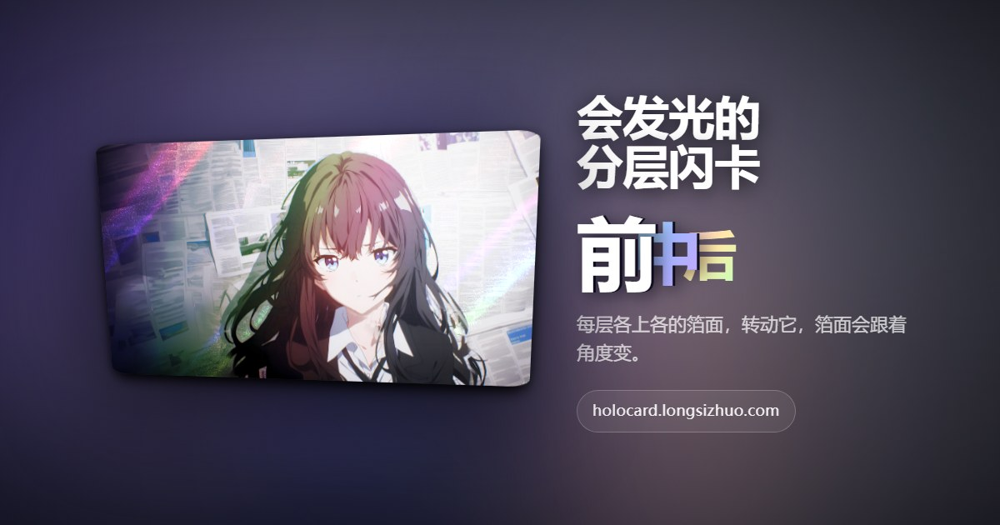

# HoloCard

中文 | [English](README.en.md)

[]([https://holocard.longsizhuo.com](https://raw.githubusercontent.com/longsizhuo/holocard/main/public/og-en.jpg))

https://github.com/longsizhuo/holocard ｜ 线上 https://holocard.longsizhuo.com

上传一张照片，自动切成前中后景，每层各上各的箔面，渲染成可交互的闪卡。

箔面效果和交互手感移植自 [pokemon-cards-css](https://github.com/simeydotme/pokemon-cards-css)
（Simon Goellner，GPL-3.0）。那个项目的每张卡都要作者手工准备一张遮罩图，标出「箔面从哪里透出来」；
HoloCard 做的事情是**用分层算法自动生成这张遮罩**，于是任意一张照片都能变成闪卡。

> 状态：早期。渲染器、分层流水线、边缘精修、服务端处理都已跑通并上线：https://holocard.longsizhuo.com
> 页面有中文、英文、日文；做好的卡可以存成动图：iPhone 上是 GIF，安卓上是动态照片，电脑上是 APNG。

## 一张卡由什么叠成

结构对应真实闪卡的印法：底材是箔，主体用不透明油墨盖住所以哑光，背景不盖所以闪。

| | 作用范围 | 随视差移动 | 何时出现 |
|---|---|---|---|
| **景深层** | 各层自己的画面 | 是，各层系数不同 | 始终 |
| **每层的箔面** | 只在该层的 alpha 形状内 | 是，跟着所在层 | 一悬停就亮 |
| **整卡炫光** | 整张卡面 | 否 | 只在特定倾角浮出细微五彩 |
| **整卡高光** | 整张卡面 | 否 | 跟随指针 |

默认的箔面分配是「最远层上日柱、中间层上经典闪卡、最近层（主体）哑光」，
演示页上每层都有下拉框可以换。

每层的画面和箔面包在同一个带 `transform` 的容器里，这有两个作用：箔面天然跟着所在层一起动；
而且 `transform` 会产生独立的层叠上下文，箔面的 `color-dodge` 只和**这一层自己的画面**混合，
不会透下去染到更远的层。

## 分层流水线

```
照片
 └→ Depth Anything V2-Small ──→ 连续深度图（决定层序）
      └→ 深度直方图谷底切层 ──→ 层数自适应 2~4 层
           └→ BiRefNet_lite 抠主体（仅服务端）──→ 主体单独一层，深度切点只留主体身后的
           └→ 深度边缘吸附 + 前景膨胀 ──→ 物体边缘变成干净的台阶
                └→ 引导滤波精修 ──→ 层边界吸附到原图里真实的物体边缘上
                     └→ 每层 alpha（同时也是这一层的箔面遮罩）
                          └→ 逐层补全 + 镜像纹理填充 ──→ 每层向遮挡它的层身后延伸
                               └→ .layers ──→ 渲染器
```

每一层同时承担两个角色：带视差的画面，以及这一层箔面的遮罩。所以这里需要两种信息——

- **谁在前面**（排序）：来自单目深度估计。抠图模型只分「主体 / 背景」，给不出三层以上的层序。
- **边界在哪**（遮罩质量）：遮罩边缘就是箔面边缘，毛不毛一眼就能看出来。
  主体的边界来自抠图模型（服务端，见下面「BiRefNet：服务端抠主体」）；背景里的层边界来自深度，
  深度图在物体边缘是糊的，还常常往物体里缩几个像素，所以要另外精修，见下面「边缘精修」。

几个设计决定：

**层边界落在深度直方图的谷底，不是均匀切。** 谷底就是场景中本来没什么东西的那些距离。
在有内容的地方硬切会把一个物体劈成两半。层数也是算出来的——很多照片本来就只有两层。

**主体的边界不能交给深度。** 只看深度时层边界是一条等深度线；一群人站在同一个距离上，深度连成一片，
这条线切在哪都会从人身上穿过去。换更准的深度模型也没用——模型越准，越准地从人身上穿过去。
所以服务端先抠出主体：主体单独一层、轮廓就是抠图的轮廓，深度只管前后和视差。
深度切点只留主体身后、落在真实谷底上、切完还剩像样面积（≥2% 画面）的；穿过主体的、主体前面的、
等质量兜底的都不要。主体和身后那层之间有没有真实的遮挡台阶，决定它们能不能相对滑动——
招牌上的字、证件照上的人会被当成主体抠出来，可它们和背景是同一个平面，一滑就浮起来。
抠不出主体（纯风景）或者浏览器端退回处理时，照旧只按深度切层。

**边界羽化而不是硬阈值。** 硬切会把一圈背景像素粘在前景层上，一做视差位移那圈脏边就跟着主体飘。

**深度边缘要先吸附成台阶。** 单目深度图在物体边缘是一段斜坡，斜坡中段的深度值会恰好落进
「中间层」的区间，在物体轮廓外形成一圈被误分的细环，一动起来就和物体分离成鬼影。
用形态学 toggle mapping 把陡坡压成台阶；落差小的平缓延展面不动，那里要的恰恰是平滑过渡。

**前景要往外长一点，但只长一点。** 深度边界和物体真实边缘总有几个像素出入，而且常常往物体里缩，
缩进去的那一圈会留在后面的层里——物体一挪开，它自己的描边就留在了原地。
让更近的区域统一向外膨胀，物体的边缘就跟着物体走。但膨胀吃进来的那圈背景是不透明的，
白墙、天空前的主体会因此带一道亮边，所以只长 2 像素；物体边缘不留在背景里，靠的是背景层把遮挡区外扩一圈再补。

**软边要去掉背景色。** 半透明边缘像素的颜色是前景和身后背景的混合：`C = a·F + (1 − a)·B`。
直接存 C 的话，头发、毛边会带着原来那块背景的颜色一起动。由远及近逐层合成，B 取身后此刻实际垫着的颜色：
身后是原图（深度平缓过渡的地方）就反解出 F 存进层里，静止时叠回去恰好还是原图。
身后是补出来的（物体真实边缘上）就不能反解：补的颜色只是猜的，猜错的部分被放大 `(1 − a)/a` 倍，
主体身边一有光晕、轮廓光，或者抠图把透明度估宽一圈，F 就被推到纯白，主体镶着一圈白边跟着走。
那里改用邻域估计 `F = C + (1 − a)·(邻域前景均值 − 邻域背景均值)`（blur-fusion，BiRefNet 官方的前景色估计同一路子），
误差只乘 `1 − a`，不会放大。

**每个非最前层都要补全，不只是最底层。** 前景挪开后，露出来的应该是紧挨着它的那一层的延续。
做法：对每个被挡住的像素，找离它最近的可见像素属于哪一层，就认为哪一层延伸到了这里。
只补最底层的话，中间层会在前景的原始轮廓处戛然而止，画面和箔面一起断掉。

**补进去的颜色要有纹理。** 箔面靠 `color-dodge` 点亮底图里的亮像素，平滑色块上是点不亮的。
所以填充以最近的源像素为镜面，把边界另一侧等距处的真实像素搬过来；push-pull 平滑填充只用来兜底。
全程不需要神经网络——视差位移只有几十像素，露出来的是细条不是大洞。
试过在服务端接 LaMa（Apache-2.0）补洞：2 核 10 秒、900MB；主体占大半画面时它会把主体的颜色延伸进洞里，
补出一块深色糊影，反而是个鬼影。不划算。

## 边缘精修

用**引导滤波**（guided filter）把层边界吸附到原图里真实的物体边缘上。零下载、纯 JS、对任何图都生效。

原理：在每个局部窗口里，假设精修后的 alpha 是向导图的线性函数 `q = a·I + b`，用粗遮罩去最小二乘拟合。
向导图里有边缘的地方，alpha 就沿着那条边缘跳变；向导图平坦的地方拟合不出东西。
在标准做法之上加了两道保险，因为我们只想修正「层边界」这一条线，不是做通用的平滑：

- 只在层边界两侧的**不确定带**里生效，带外原样保留
- 用局部拟合优度 **R²** 当置信度。线性模型解释不了这条边界，说明原图在这里本来就没有边
  （比如近处地面和中景地面的交界），那就不动它

精修是针对「分界」做的而不是针对「层」：一条分界修好了，两侧的层同时受益，alpha 天然互补。
这里有两个坑，都是接入精修之后才暴露的：

- 由分界遮罩组合出各层 alpha **必须用减法** `A₀ − A₁`，不能用乘法 `A₀·(1 − A₁)`。
  分界是嵌套的，一个被前景覆盖了 t 的边缘像素对两条分界的取值都是 t：减法给出中间层 0，
  乘法给出 `t(1−t)`，会在每条软边上给中间层凭空造出一圈环。硬边上两者没区别，所以之前没发现。
- 两条分界落在同一条物体边缘上时（头部直接压在天空上，中间层在附近不存在），要**共用同一条精修后的边**，
  否则各修各的，软边形状不一致，相减还是会剩一圈。

向导是可替换的。现在用的是原图 RGB；任何能产出前景 alpha 的东西都可以作为额外的向导通道接进来
（`ExtractOptions.extraGuide`），算法不用改。

### BiRefNet：服务端抠主体

BiRefNet_lite（MIT）在服务端给出主体 alpha，主体层的边界直接用它，不再过引导滤波。
它在浏览器里跑不起来，四条路都试过，所以浏览器端的退回处理不抠主体：

| 路径 | 结果 |
|---|---|
| WebGPU | 模型里有个 16 路 Concat，单个着色器要绑 17 个 storage buffer，适配器上限是 16 |
| WASM，1024 输入 | `std::bad_alloc`，激活值装不进 32 位寻址的 WASM 堆 |
| WASM，关掉 arena 分配器 | 同上 |
| WASM，512 / 768 输入 | 这份 ONNX 导出时把输入焊死在 1024×1024，其他尺寸直接拒收 |

复现：`node scripts/probe-matte.mjs --image 照片路径`。

服务端最早测出来峰值 12GB，是 onnxruntime 的内存池（arena）作怪：开着的话推理用过的内存不还给系统。
关掉之后峰值 6.9GB，推理完回落到 0.6~0.8GB，所以可以放在服务进程里跑。
服务的内存上限（systemd 的 `MemoryMax`）不到 8GB 时不抠主体、只按深度切层，免得一抠就被 OOM 杀掉。

选型（staging 16 张图，以完整版为参照，4 核 ARM）：

| 型号 | 每张 | 峰值内存 | 和完整版比 |
|---|---|---|---|
| 完整版（Swin-L），1024 输入 | 54 秒 | 8.8GB | —— |
| **lite（Swin-T），1024 输入** ← 现在用的 | 23 秒 | 6.9GB | 主体重合度 0.885，边缘最接近；白底线稿会把人物内部当背景 |
| 512 版，int8 量化 | 11 秒 | 4.4GB | 主体重合度 0.885，边缘糊一些；招牌上的字认不全 |

三者训练集相同（官方 model zoo），lite 只是骨干网络小。半精度在 ARM CPU 上反而慢四成；
lite 量化成 int8 只快一成、结果完全一样，不值得多一道自己量化的工序。
换型号只动 `src/segmenter/matte.ts` 的 `MATTE_MODEL_ID` 和输入边长。

引导滤波用颜色当向导，有它的天花板：**描边颜色和背景接近时分不开**（黑色描边配深色背景，
线性颜色模型会把描边往背景那边归），发丝这种半透明细结构也不如专门的抠图模型。

## 渲染器

交互手感逐条对齐上游：

- **弹簧驱动**：转角、高光、背景位移各一根弹簧，跟手时 `stiffness 0.066 / damping 0.25`；
  松手后等 500ms，再用很软的弹簧（`0.01 / 0.06`，soft 启动）缓缓回正。
  弹簧语义与 svelte/motion 一致，所以上游调好的参数可以原样用。
- **转角映射**：`rotateY(-(x-50)/3.5) rotateX((y-50)/3.5)`，最大约 ±14.3°，透视 600px。
  指针所在的一侧朝观察者抬起。
- **背景位移收窄**到 37%–63% / 33%–67%，箔面花纹只是微微游动，不会满屏乱扫。
- **`--pointer-from-center`** 调制亮度，越靠卡片边缘箔面越亮。

CSS 变量名（`--pointer-x`、`--background-x`、`--card-opacity` 等）刻意与上游保持一致，
以后要再移植别的稀有度，配方可以直接贴进 `foils.css`。

两张纹理（grain / glitter）是运行时程序化生成的，仓库里没有二进制素材。

我们自己加的部分：

**视差不用 `translateZ`。** 它会引入透视缩放，每层大小对不上。改成每层各自做 2D 位移，
位移量正比于该层的视差系数。近层的位移方向与指针相反——右缘抬起相当于观察者站到了右边，
近处的东西相对远处向左移。

**焦平面在中间，放大补偿所有层共用一个倍数。** 以最远和最近层的中点为不动面：近处的往外飘、远处的往里退，
同样的立体感下每层只需挪一半。默认主体和背景最多错开 10% 卡宽。
平移后另一侧会露白，所以要放大补偿——但必须**所有层同一个倍数**（按位移最大的那层算）。
以前是各层按自己的位移各放各的，而放大是绕卡片中心，结果静止时主体就比它在背景里留下的坑大一圈，
狗头和身子接不上。统一之后静止时的画面和原图逐像素一致。

**高光保护。** 箔面大多是 `color-dodge`（底色 ÷ (1 − 箔色)），整卡高光是 `overlay`，亮部一叠就顶到纯白，
白衣服、白毛的纹理全没了。所以每层箔面、整卡炫光和高光的遮罩都按画面亮度打折：亮度 0.6 以下不变，
往上平滑减到纯白处只剩 0.2（`renderer/highlight.ts`）。暗部和中间调的效果不变，快要顶白的地方收着点。
炫光和高光按视差分组各压一份，遮罩只看这一组的画面，并且跟着这一组平移、放大，光本身还是整卡一片。
以前是整卡一张静止遮罩，层一动遮罩里的轮廓就和人物错开：深色描边原来的位置落到亮背景上，那里炫光全开，人物边上多出一道白带。

**调参时自动转到峰值。** 拖滑块时手指不在卡片上，卡片是静止的，而箔面、炫光要转起来才显，
视差要歪过去才看得出。所以 `preview()` 在拖任何滑块时把卡片转到炫光最亮的角度，停一会儿再回正。

**整卡炫光是角度事件。** 由当前转角推卡面法线，与「能把光源反射进眼睛」的那个朝向做点积，
宽窄两瓣叠加。默认参数下的强度：静止 0.12 / 峰值倾角 1.00 / 反方向 0.01。

**`setPose({x, y})`** 可以不走动画直接把卡片摆到指定姿态，用来生成静态预览图，
或者用陀螺仪之类的外部输入驱动。

## 卡带与开包

首页主舞台是一条卡带：这次访问做的卡左右切换，最新的在右边，左右按钮在卡牌两侧的留白里（键盘 ← → 也行）。
上传后最右边先出现一个卡包，等的时候可以按「<」回去玩上一张；做好了卡包亮起来，停在别处时「>」上亮个小点。
沿顶部封口横着划过去撕开：划过的那段封条跟着手指翘起来，划过六成松手就整条扯下甩出去，
卡从袋口升出一截，空袋子往下掉；或者点一下，抖几下炸开。新卡带着一点厚度转一圈亮相，转过去能看到卡背。
「减少动态效果」下不播动画直接开。

卡包是 WebGL 画的真 3D 铝箔袋（`src/demo/pack-gl.ts`）：袋身鼓起的曲面、封口压痕和锯齿、按箔面类型变的彩虹，
正面印 involutionhell.com 的 logo。默认彩虹闪粉，卡的箔面被人改过（别人调好再分享的）才跟着卡背景那层的箔走。
卡升出袋口的那一刻，卡包把这张卡在屏幕上的位置交给卡带，真正的闪卡从那里接着转（`src/demo/deck.ts`）。
没有 WebGL 的设备退回平面版：一张两层（包身、封条）的卡，图案在浏览器里现画（`src/demo/pack-art.ts`），交给同一个渲染器。

别人分享的卡在这台设备上第一次打开，首屏也是一个做好的卡包，开过就记在本机（`holocard:seen`），下次直接看卡；
自己做的卡、截图和导出用的页面不出卡包。

开包有音效（撕、扯下、卡滑出、转圈、炸开、发牌、做好了的提示铃），全部用 Web Audio 现合成，不带音频文件（`src/demo/sfx.ts`）。
有卡包时卡带右下角出现喇叭按钮，可以关掉，记在本机。

做好的卡记在 sessionStorage，刷新后按它把卡带排回来。改了开包相关的代码之后：
- `node scripts/verify-pack.mjs`：走一遍流程并断言（不需要分层服务，接口在浏览器里模拟）
- `node scripts/film-pack.mjs`：用虚拟时钟逐帧截开包动效，拼成胶片，从头到尾看一遍
- `node scripts/render-sfx.mjs`：把音效离线渲染成 wav 试听，顺带查有没有无声、爆音

## 我的卡册

「我的卡册」就是这台设备上做过的卡（登录了再加上账号名下的卡），网格排列，最新的在前，不用手动加。
每次打开先开一包：撕开或点开之后，卡一张张从卡包里飞出、落进网格，整个发完封顶 2 秒，发牌时点一下全部直接落位；
一张卡都没有、或者开着「减少动态效果」时直接是网格。
不登录时，数据是删除口令那份记录（每做好一张就记下 id 和口令），只在这台设备的浏览器里，和删除口令一个待遇。
卡片本身在服务端，过期或删掉了显示「已过期」。以前还能自己建卡册、把卡加进去，用的人还不多，先只留这一本自动记的。
网格里的缩略图（`/api/layers/<id>/thumb.jpg`，最长边 480）在分层完成时顺手做好；早期没存原图的卡，第一次有人要时用各层叠出来的画面现做，同一张卡只做一次、所有卡排队一次一张。代码在 `src/demo/albums-ui.ts`。

## 登录（可选）

可以用 [involutionhell](https://involutionhell.com) 的账号登录（入口在卡册顶上），不登录照常用。登录以后：

- 登录着做的卡直接归到账号下，换手机、换电脑登录都能看到、分享、删除；
- 这台设备上以前做的卡，在卡册里勾选「放进账号」认领。认领之后这台设备上原来的删除口令作废，主人只认账号；
- HoloCard 只拿到账号的 id、名字和头像，不拿邮箱，也碰不到你在 involutionhell 的登录状态。

流程是授权码加 PKCE：HoloCard 跳到 involutionhell 的授权页，用户确认后带着一次性的码跳回来，服务端拿码直接找 involutionhell 后端换用户，之后发自己的会话。代码在 `server/auth.ts`，自检是 `scripts/verify-auth.mjs`。

## 对外接口

用 involutionhell 账号登录后，在页头的个人中心里自己申请 key（每个账号 24 小时最多 20 张，同时只能有一个 key，可以随时吊销重新申请）。
要更高额度的找站长，由站长发（见 deploy/README.md「对外接口的 key」）。
接口做的卡是私有的：只有提交它的 key 能看、能下载、能删，不能分享、不能导出，**提交后 24 小时自动清掉**，结果请自己存走。
裸露识别做完才交付，分数高的直接拒绝（网页上传只记录不拦）。排队时网页用户优先。

```bash
# 提交一张图（JPEG / PNG / WebP / AVIF / HEIC，16MB 以内），返回 202 和卡片 id
curl -X POST https://holocard.longsizhuo.com/v1/cards \
  -H "Authorization: Bearer hc_..." -H "Content-Type: image/jpeg" --data-binary @photo.jpg

# 轮询状态：queued → running → done / failed。done 时带 manifest（格式见下文 .layers）和每个文件的下载地址
curl https://holocard.longsizhuo.com/v1/cards/<id> -H "Authorization: Bearer hc_..."

# 下载文件（manifest.json、layer-N.webp、original.*），同样要带 key
curl -O https://holocard.longsizhuo.com/v1/cards/<id>/files/layer-0.webp -H "Authorization: Bearer hc_..."

# 不要了可以提前删
curl -X DELETE https://holocard.longsizhuo.com/v1/cards/<id> -H "Authorization: Bearer hc_..."
```

额度：每个 key 每 24 小时默认 50 张（发 key 时可以改），同时最多 3 张在上传、排队或处理中，每 10 分钟最多尝试提交 30 次；所有 key 加起来每天 500 张。
超了回 429（`quota_exceeded`、`too_many_in_flight`、`rate_limited`）或 503（`api_daily_limit`、`queue_full`、`busy`）。key 被吊销后立即失效，还在排队的卡也不再处理。
失败时 `error.code` 是 `nsfw_rejected`（裸露识别拒绝）、`moderation_unavailable`（识别不可用，宁可不做）或 `processing_failed`。

## 嵌入到你的网页（npm 包 `holocard`）

接口交付的是一组文件（`manifest.json` 和各层图片），要在网页上动起来得有播放器。`packages/player` 就是它：
一个自定义元素 `<holo-card>`，贴一段代码就能用，React、Vue 里也能直接写。

```html
<script type="module" src="https://cdn.jsdelivr.net/npm/holocard@0.1/dist/holocard.js"></script>
<holo-card src="https://你的域名/cards/my-card"></holo-card>
```

把卡片的 `manifest.json` 和各层文件下载到自己的服务器上（文件名不变），`src` 指向那个目录。
作者调好的箔面、炫光、视差照样生效；样式装在 Shadow DOM 里，和宿主页面互不影响。用法见 [packages/player/README.md](packages/player/README.md)。
构建 `pnpm build:player`，自检 `node scripts/verify-player.mjs`；打 `player-v<版本>` 的 tag 由 CI 发到 npm（`.github/workflows/publish-player.yml`）。

## `.layers` 格式

这个格式把算法和渲染解耦。任何能产出它的东西都能喂给渲染器，渲染器也可以被单独拿去用——
手工在 Photoshop 里切的图一样能渲染。

```
mycard.layers/
├── manifest.json
├── layer-0.png      # 最远
├── layer-1.png
└── layer-2.png      # 最近
```

```json
{
  "version": 1,
  "source": { "width": 734, "height": 1024 },
  "layers": [
    {
      "file": "layer-0.png", "depth": 0.08, "parallax": 0.0,
      "bbox": [0, 0, 734, 1024], "inpainted": true,
      "foil": { "type": "sunpillar", "intensity": 1 }
    },
    {
      "file": "layer-2.png", "depth": 0.92, "parallax": 1.0,
      "bbox": [120, 80, 500, 900], "inpainted": false,
      "foil": { "type": "none", "intensity": 1 }
    }
  ],
  "effects": {
    "halo": { "intensity": 0.35, "light": { "peakAt": [0.7, -0.7], "sharpness": 120 } },
    "glare": true,
    "parallax": { "enabled": true, "amplitude": 0.1 }
  }
}
```

`effects.parallax` 是作者存过的立体视差（`enabled` 开关、`amplitude` 振幅，0～0.16），可以没有，没有时看的人按自己本机的偏好。卡的主人在面板上调的箔面、炫光、视差会自动存回服务端（`PUT /api/cards/<id>/config`，校验见 `src/format/config.ts`），分享页、预览图、导出的动图都按存进去的来。

层图可以是浏览器能解的任何格式；服务端存的是 WebP（画面有损、alpha 无损），体积约为 PNG 的十分之一。

`foil.type` 目前有四种：`none`（哑光）、`holo`（经典闪卡）、`sunpillar`（V 卡日柱）、`rainbow`（彩虹闪粉）。

## 跑起来

```bash
pnpm install
pnpm dev           # 前端，固定在 5273
pnpm dev:server    # 另开一个终端：分层服务，监听 8791
```

演示页默认加载一张切好的示例卡（`public/samples/demo`，就是分享图上那张），拖一张照片进去会走完整流水线。
`pnpm dev` 会把 `/api` 代理到 8791；不起服务端也能用，会自动回退到浏览器端流水线。

服务端首次运行需要本地有权重，放在 `.models/`（`pnpm dev:server` 默认就读这里）：

```bash
D=.models/onnx-community/depth-anything-v2-small
mkdir -p $D/onnx
B=https://huggingface.co/onnx-community/depth-anything-v2-small/resolve/main
curl -sL $B/config.json -o $D/config.json
curl -sL $B/preprocessor_config.json -o $D/preprocessor_config.json
curl -sL $B/onnx/model_quantized.onnx -o $D/onnx/model_quantized.onnx
```

环境要求、改完代码跑哪个验证脚本、常见问题见 [DEVELOPMENT.md](DEVELOPMENT.md)。

录演示 GIF（需要本机有 Edge 和 ffmpeg，开发服务要先跑着）：

```bash
pnpm capture --image 照片路径 --out out/demo.gif
```

脚本用无头 Edge 走真实的上传路径，再用 `setPose` 逐帧摆姿态截图，每一帧都是确定性的。
加 `--dump` 会额外把每一层导出成 PNG，排查分层问题时很有用；只想要层不想等录制就再加 `--no-gif`。

### 调分享图

```bash
pnpm og                    # 用 scripts/fixtures/og-test.jpg 出一张分享图，写到 out/og-preview.jpg 并打开
pnpm og 图片路径            # 换一张图
pnpm og --watch            # 改了 src/ 下的样式或代码，保存即重出（约 2 秒）
pnpm og --pose 20,80       # 换个角度看箔面和炫光
pnpm og --size 1280x640    # GitHub 仓库社交预览图的尺寸
pnpm og --lang en          # 右边那段字用英文（en / ja）
pnpm og --export gif       # 出一张 iPhone 的 GIF（或 motion / apng），写到 out/export/
```

和线上是同一套渲染：前端现构建，截图直接调服务端的 `renderPreview`，这里看到什么，分享出去就是什么。
分层结果按图片哈希缓存在 `.og-cache/`，调样式时不会反复跑模型。需要本地有 `.models/` 下的权重。
